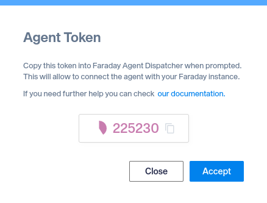
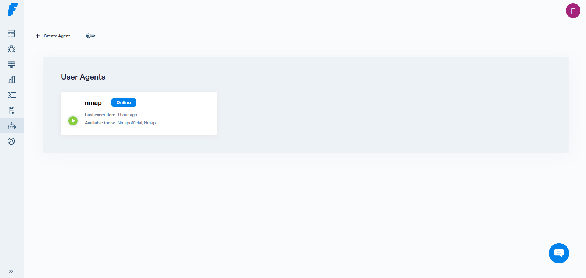
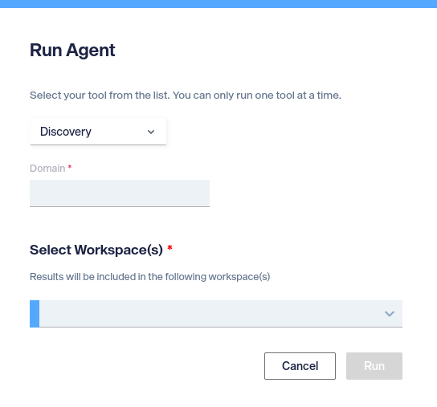

# Getting started

## Install

=== "pip"
    ```shell
    $ pip install faraday_agent_dispatcher
    ```

=== "git"
    ```shell
    $ git clone https://github.com/infobyte/faraday_agent_dispatcher.git
    $ cd faraday_agent_dispatcher
    $ pip install .
    ```

## Configure your agent

The dispatcher can be configured with the `wizard` command: <!--Add link to proper page-->

```shell
$ faraday-dispatcher config-wizard
```

The wizard will ask for which configuration you would set, the
 [agent configuration](#agent-configuration) or the
 [executors configuration](#executors-configuration).

### Agent configuration

The proper configuration differ if you want to use a SSL connection with your
 [Faraday][faraday] server. When using SSL you can use a self signed certificate!

!!! info
    The token required can be taken in the http(s)://__{faraday_server_host}__/#/admin/agents

    
    Your token is: _ImalA8Cg1L6Z5Qbx2u9CFAsob_

Examples:

=== "https"
    !!! example
        $ **faraday-dispatcher config-wizard**
        Do you want to edit the [A]gent or the [E]xecutors? Do you want to [Q]uit?
         (A, E, Q) [Q]: **A**
        _Section: server_
        host [127.0.0.1]:
        ssl [True]:
        ssl_port [443]:
        Default SSL behavior? (Y, N): **N**
        ssl_cert []:
        _Trying to save with empty value_
        ssl_cert []: **/home/path/to/the/cert.pub**
        workspace [workspace]: **sslWorkspace**
        _Section: tokens_
        registration [ACorrectTokenIs25CharLen]: **1234567890123456789012345**
        _Section: agent_
        agent_name [agent]: **sslAgent**
        Do you want to edit the [A]gent or the [E]xecutors? Do you want to [Q]uit?
         (A, E, Q) [Q]: **Q**

=== "http"
    !!! example
        $ **faraday-dispatcher config-wizard**
        Do you want to edit the [A]gent or the [E]xecutors? Do you want to [Q]uit?
         (A, E, Q) [Q]: **A**
        _Section: server_
        host [127.0.0.1]:
        ssl [True]: **False**
        api_port [5985]:
        websocket_port [9000]:
        workspace [workspace]: **sslFalseWorkspace**
        _Section: tokens_
        registration [ACorrectTokenIs25CharLen]: **1234567890123456789012345**
        _Section: agent_
        agent_name [agent]: **sslFalseAgent**
        Do you want to edit the [A]gent or the [E]xecutors? Do you want to [Q]uit?
        (A, E, Q) [Q]: **Q**

        !!! warning
            We stronglly recommend to use `https` if not using within localhost

### Executors configuration

When adding an executor you can set an executor with minimum configuration,
 which ones we maintain, call as official executor; or your own custom
 executors.

In the next examples, you can see how to add a nessus executor, both as an
official and custom executor:

=== "Official"
    ???+ example
        $ **faraday-dispatcher config-wizard**
        Do you want to edit the [A]gent or the [E]xecutors? Do you want to
        [Q]uit? (A, E, Q) [Q]: **E**
        The actual configured executors are: _[]_
        Do you want to [A]dd, [M]odify or [D]elete an executor? Do you want to
        [Q]uit? (A, M, D, Q) [Q]: **A**
        Name: **official**
        Is a custom executor? (Y, N) [N]: **N**
        The executors are:
        _1: wpscan.py_
        _2: sublist3r.sh_
        _3: nikto2.py_
        _4: nessus.py_
        _5: w3af.py_
        _+: Next page_
        _Q: Don't choose_
        Choose one: **4**
        Max data sent to server [65536]: **65536**
        Environment variable NESSUS_USERNAME value: **username**
        Environment variable NESSUS_PASSWORD value: **password**
        Environment variable NESSUS_URL value: **https://nessus_url.com**
        The actual configured executors are: _['official']_
        Do you want to [A]dd, [M]odify or [D]elete an executor? Do you want to
        [Q]uit? (A, M, D, Q) [Q]: **Q**
        Do you want to edit the [A]gent or the [E]xecutors? Do you want to
        [Q]uit? (A, E, Q) [Q]: **Q**

=== "Custom"
    ???+ example
        $ **faraday-dispatcher config-wizard**
        Do you want to edit the [A]gent or the [E]xecutors? Do you want to
        [Q]uit? (A, E, Q) [Q]: **E**
        The actual configured executors are: _[]_
        Do you want to [A]dd, [M]odify or [D]elete an executor? Do you want to
        [Q]uit? (A, M, D, Q) [Q]: **A**
        Name: **custom**
        Is a custom executor? (Y, N) [N]: **Y**
        Command to execute [exit 1]: **python3
        {REPO_FOLDER}/faraday_agent_dispatcher/static/executors/official/nessus.py**
        Max data sent to server [65536]: **65536**
        The actual custom executor's environment variables are: _[]_
        Do you want to [A]dd, [M]odify or [D]elete an environment variable? Do you
         want to [Q]uit? (A, M, D, Q) [Q]: **A**
        Environment variable name: **NESSUS_USERNAME**
        Environment variable value: **username**
        The actual custom executor's environment variables are: __['nessus_username']__
        Do you want to [A]dd, [M]odify or [D]elete an environment variable? Do you
         want to [Q]uit? (A, M, D, Q) [Q]: **A**
        Environment variable name: **NESSUS_PASSWORD**
        Environment variable value: **password**
        The actual custom executor's environment variables are: _['nessus_username',
         'nessus_password']_
        Do you want to [A]dd, [M]odify or [D]elete an environment variable? Do you
         want to [Q]uit? (A, M, D, Q) [Q]: **A**
        Environment variable name: **NESSUS_URL**
        Environment variable value: **https://nessus_url.com**
        The actual custom executor's environment variables are: _['nessus_username',
         'nessus_password', 'nessus_url']_
        Do you want to [A]dd, [M]odify or [D]elete an environment variable? Do you
         want to [Q]uit? (A, M, D, Q) [Q]: **Q**
        The actual custom executor's arguments are: _[]_
        Do you want to [A]dd, [M]odify or [D]elete an argument? Do you want to
         [Q]uit? (A, M, D, Q) [Q]: **A**
        Argument name: **NESSUS_SCAN_NAME**
        Is mandatory? (Y, N): **N**
        The actual custom executor's arguments are: _['nessus_scan_name']_
        Do you want to [A]dd, [M]odify or [D]elete an argument? Do you want to
         [Q]uit? (A, M, D, Q) [Q]: **A**
        Argument name: **NESSUS_URL**
        Is mandatory? (Y, N): **N**
        The actual custom executor's arguments are: _['nessus_scan_name',
         'nessus_url']_
        Do you want to [A]dd, [M]odify or [D]elete an argument? Do you want to
         [Q]uit? (A, M, D, Q) [Q]: **A**
        Argument name: **NESSUS_SCAN_TARGET**
        Is mandatory? (Y, N): **Y**
        The actual custom executor's arguments are: _['nessus_scan_name',
        'nessus_url', 'nessus_scan_target']_
        Do you want to [A]dd, [M]odify or [D]elete an argument? Do you want to
         [Q]uit? (A, M, D, Q) [Q]: **A**
        Argument name: **NESSUS_SCAN_TEMPLATE**
        Is mandatory? (Y, N): **N**
        The actual custom executor's arguments are: _['nessus_scan_name',
        'nessus_url', 'nessus_scan_target', 'nessus_scan_template']_
        Do you want to [A]dd, [M]odify or [D]elete an argument? Do you want to
         [Q]uit? (A, M, D, Q) [Q]: **Q**
        The actual configured executors are: _['custom']_
        Do you want to [A]dd, [M]odify or [D]elete an executor? Do you want to
         [Q]uit? (A, M, D, Q) [Q]: **Q**
        Do you want to edit the [A]gent or the [E]xecutors? Do you want to [Q]uit?
         (A, E, Q) [Q]: **Q**

        !!! warning
            Compared to the official executor example, this is more complex and
            ask for both arguments and configuration environment variables. We
            strongly recommend to read the [custom][custom] executors technical
            section

If you want to know how the executors work, you can check [their][executors]
technical section.

## Running the agent

### Start the agent

The dispatcher can be configured with the `run` command: <!--Add link to proper page-->

```shell
$ faraday-dispatcher run
```

???+ success "Expected output"
    The expected output when the dispatcher run command is as follows
    ```shell
    $ faraday-dispatcher run
    INFO - token_registration_url: {faraday_host}/_api/v2/ws/agent2/agent_registration/
    INFO - Registered successfully
    INFO - Connection to Faraday server succeeded
    ```

### Running an executor from faraday

1. Go to https://__{faraday_server_host}__/#/admin/agents
1. Select your workspace in the dropdown
   
1. Click Execute in the agent
1. Select the executor and fill the arguments
   
1. Click `Run`

???+ success "Expected output"
    ```shell
    INFO - Parsing data: {"execution_id": XX, "agent_id": XX, "action": "RUN", "executor": {EXECUTOR_NAME}, "args": {EXECUTOR_ARGS}}
    INFO - Running {EXECUTOR_NAME} executor
    [Executor data]
    INFO - Executor {EXECUTOR_NAME} finished successfully
    ```

???+ Fail "Error output"
    ```shell
    INFO - Parsing data: {"execution_id": XX, "agent_id": XX, "action": "RUN", "executor": {EXECUTOR_NAME}, "args": {EXECUTOR_ARGS}}
    INFO - Running {EXECUTOR_NAME} executor
    [Executor data and errors]
    WARNING - Executor {EXECUTOR_NAME} finished with exit code 1
    ```

[faraday]: https://github.com/infobyte/faraday
[executors]: technical/agents.md#executors
[custom]: technical/agents.md#custom-executors
