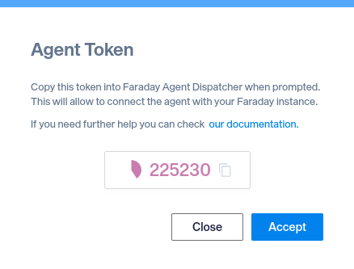
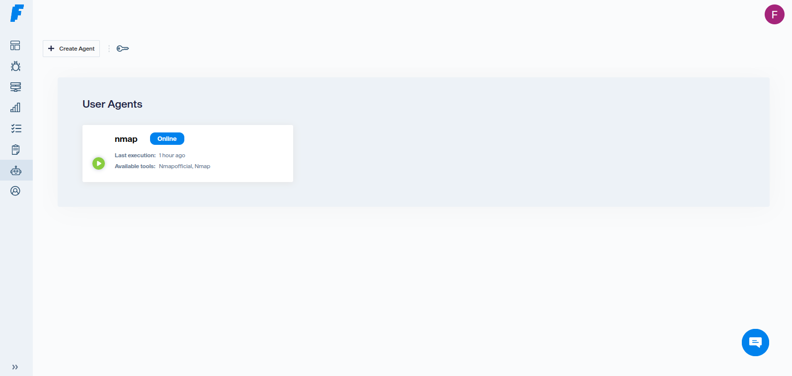
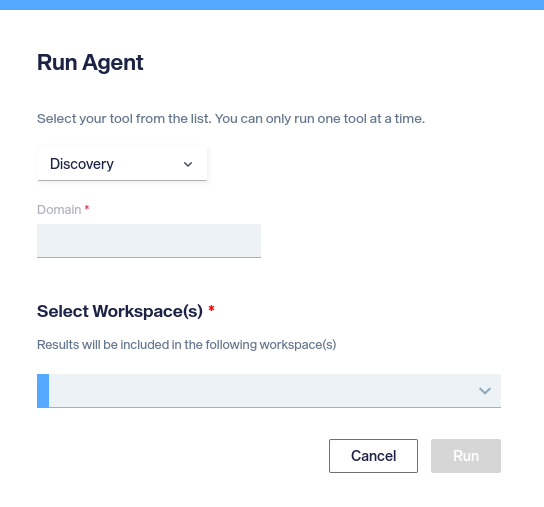

# Getting Started

This guide walks through installing the Faraday Agent Dispatcher, configuring it to connect to your Faraday server, registering an agent, and running your first executor.

**Dispatcher version:** 3.9.1 | **Python:** 3.10+

---

## Install

=== "pip (recommended)"
    ```shell
    pip install faraday_agent_dispatcher
    ```

    This installs the `faraday-dispatcher` command and all 27 official executor scripts.

=== "From source"
    ```shell
    git clone https://github.com/infobyte/faraday_agent_dispatcher.git
    cd faraday_agent_dispatcher
    pip install .
    ```

=== "Docker"
    ```shell
    docker pull faradaysec/faraday_agent_dispatcher
    ```

    See the [Docker Deployment Guide](misc/docker.md) for full Docker instructions including docker-compose setup and pre-installed tools.

---

## Prerequisites

Before configuring the dispatcher, ensure you have:

- **Faraday Server** v5.x running and accessible
- **Network access** from the agent host to the Faraday server on the API port (default: 5985 for HTTP, 443 for HTTPS behind NGINX)
- **Registration token** from the Faraday admin panel (see [Agent Registration](#agent-registration))
- **Security tools** installed locally for any executors you want to run (e.g., Nmap, Nessus, Nuclei)

---

## Configure Your Agent

### Interactive wizard

The easiest way to configure the dispatcher:

```shell
faraday-dispatcher config-wizard
```

The wizard prompts you to configure **Agent settings** or **Executor settings**. Choose `A` for agent configuration or `E` for executors.

#### Agent configuration

The wizard asks for your Faraday server connection details. The settings differ depending on whether you use SSL.

=== "HTTPS (recommended)"
    !!! example
        $ **faraday-dispatcher config-wizard**
        Do you want to edit the [A]gent or the [E]xecutors? Do you want to [Q]uit?
         (A, E, Q) [Q]: **A**
        _Section: server_
        host [127.0.0.1]: **faraday.example.com**
        ssl [Y/n]: **Y**
        api_port [443]:
        websocket_port [443]:
        ssl_ignore [y/N]: **N**
        _Section: agent_
        agent_name [agent]: **production-scanner**
        Do you want to edit the [A]gent or the [E]xecutors? Do you want to [Q]uit?
         (A, E, Q) [Q]: **Q**

=== "HTTP"
    !!! example
        $ **faraday-dispatcher config-wizard**
        Do you want to edit the [A]gent or the [E]xecutors? Do you want to [Q]uit?
         (A, E, Q) [Q]: **A**
        _Section: server_
        host [127.0.0.1]:
        ssl [True]: **False**
        api_port [5985]:
        websocket_port [9000]:
        _Section: agent_
        agent_name [agent]: **local-scanner**
        Do you want to edit the [A]gent or the [E]xecutors? Do you want to [Q]uit?
        (A, E, Q) [Q]: **Q**

        !!! warning
            We strongly recommend using HTTPS when the agent is not on localhost.

#### Executor configuration

When adding an executor, you can choose an **official executor** (maintained by Faraday) or a **custom executor** (your own script).

=== "Official executor"
    ???+ example "Adding an Nmap official executor"
        $ **faraday-dispatcher config-wizard**
        Do you want to edit the [A]gent or the [E]xecutors? Do you want to
        [Q]uit? (A, E, Q) [Q]: **E**
        The actual configured executors are: _[]_
        Do you want to [A]dd, [M]odify or [D]elete an executor? Do you want to
        [Q]uit? (A, M, D, Q) [Q]: **A**
        Name: **nmap_scan**
        Is a custom executor? [y/N]: **N**
        The executors are:
        _1: arachni_
        _2: burp_
        _3: crackmapexec_
        _4: gvm_openvas_
        _5: insightvm_
        _6: nessus_
        _7: nikto2_
        _8: nmap_
        _9: nuclei_
        _10: openvas_legacy_
        _+: Next page_
        _Q: Don't choose_
        Choose one: **8**
        New repository executor added
        The actual configured executors are: _['nmap_scan']_
        Do you want to [A]dd, [M]odify or [D]elete an executor? Do you want to
        [Q]uit? (A, M, D, Q) [Q]: **Q**
        Do you want to edit the [A]gent or the [E]xecutors? Do you want to
        [Q]uit? (A, E, Q) [Q]: **Q**

=== "Custom executor"
    ???+ example "Adding a custom Nessus executor"
        $ **faraday-dispatcher config-wizard**
        Do you want to edit the [A]gent or the [E]xecutors? Do you want to
        [Q]uit? (A, E, Q) [Q]: **E**
        The actual configured executors are: _[]_
        Do you want to [A]dd, [M]odify or [D]elete an executor? Do you want to
        [Q]uit? (A, M, D, Q) [Q]: **A**
        Name: **my_nessus**
        Is a custom executor? [y/N]: **Y**
        Command to execute [exit 1]: **python3 /path/to/nessus_executor.py**
        The actual custom executor's environment variables are: _[]_
        Do you want to [A]dd, [M]odify or [D]elete an environment variable? Do you
         want to [Q]uit? (A, M, D, Q) [Q]: **A**
        Environment variable name: **NESSUS_USERNAME**
        Environment variable value: **admin**
        The actual custom executor's environment variables are: _['nessus_username']_
        Do you want to [A]dd, [M]odify or [D]elete an environment variable? Do you
         want to [Q]uit? (A, M, D, Q) [Q]: **Q**
        The actual custom executor's arguments are: _[]_
        Do you want to [A]dd, [M]odify or [D]elete an argument? Do you want to
         [Q]uit? (A, M, D, Q) [Q]: **A**
        Argument name: **NESSUS_SCAN_TARGET**
        Is mandatory? [y,N]: **Y**
        The actual custom executor's arguments are: _['nessus_scan_target']_
        Do you want to [A]dd, [M]odify or [D]elete an argument? Do you want to
         [Q]uit? (A, M, D, Q) [Q]: **Q**
        The actual configured executors are: _['my_nessus']_
        Do you want to [A]dd, [M]odify or [D]elete an executor? Do you want to
        [Q]uit? (A, M, D, Q) [Q]: **Q**
        Do you want to edit the [A]gent or the [E]xecutors? Do you want to [Q]uit?
         (A, E, Q) [Q]: **Q**

        !!! warning
            Custom executors require you to manually specify environment variables
            and arguments. Read the [custom executor technical docs](technical/agents.md#custom-executors) for details on the executor API.

You can configure **multiple executors** per agent by repeating the "Add" step.

**Wizard CLI options:**

```
faraday-dispatcher config-wizard [OPTIONS]

Options:
  -c, --config-filepath PATH  Path to config file (default: ~/.faraday/config/dispatcher.yaml)
  -p, --page-size INT         Executor list page size, 2-20 (default: 10)
  --logdir PATH               Log directory (default: ~)
  --log-level TEXT             Log level: notset|debug|info|warning|error|critical
  --debug                     Enable debug logging
```

### Manual YAML configuration

The dispatcher reads its configuration from a YAML file at:

```
~/.faraday/config/dispatcher.yaml
```

You can override this path with `-c` / `--config-file`.

!!! note
    The dispatcher also supports the legacy INI format (`dispatcher.ini`) and will automatically convert it to YAML on first load. New installations should use YAML.

**Example configuration:**

```yaml
# Server connection
server:
  host: faraday.example.com
  ssl: true
  ssl_cert: ''           # Path to custom CA cert, or empty for system default
  ssl_ignore: false      # Set true to skip cert verification (not recommended)
  api_port: 443
  websocket_port: 443

# Agent identity
agent:
  agent_name: production-scanner
  description: "Nmap and Nuclei scanner on DMZ host"
  executors:
    # Official executor (uses built-in script)
    nmap_scan:
      repo_executor: nmap.py
      repo_name: nmap
      max_size: 65536
      varenvs: {}
      params: {}
    # Custom executor (your own script)
    my_scanner:
      cmd: /opt/tools/my_scanner.sh
      max_size: 65536
      varenvs:
        SCANNER_API_KEY: "your-api-key"
      params:
        target:
          mandatory: true
          type: string
          base: string

# Agent token (auto-populated after first registration)
# tokens:
#   agent: <auto-generated>
```

### Configuration reference

| Section | Key | Type | Default | Description |
|---------|-----|------|---------|-------------|
| `server` | `host` | string | `localhost` | Faraday server hostname or IP |
| `server` | `ssl` | boolean | `false` | Enable HTTPS |
| `server` | `ssl_cert` | string | `''` | Path to custom CA certificate |
| `server` | `ssl_ignore` | boolean | `false` | Skip SSL verification |
| `server` | `api_port` | integer | `5985` | REST API port |
| `server` | `websocket_port` | integer | `5985` | Socket.IO port |
| `agent` | `agent_name` | string | `unnamed_agent` | Unique agent name |
| `agent` | `description` | string | `''` | Agent description |
| `agent.executors.<name>` | `repo_executor` | string | — | Official executor filename (e.g., `nmap.py`) |
| `agent.executors.<name>` | `cmd` | string | — | Custom executor command path |
| `agent.executors.<name>` | `max_size` | integer | `65536` | Max stdout buffer per line (bytes) |
| `agent.executors.<name>` | `varenvs` | dict | `{}` | Persistent environment variables (credentials) |
| `agent.executors.<name>` | `params` | dict | `{}` | Executor argument definitions |

Each executor requires either `repo_executor` (official) or `cmd` (custom).

---

## Agent Registration

### Obtaining a registration token

1. Log in to your Faraday server as an administrator
2. Navigate to **Administration > Agents** (`https://<server>/#/admin/agents`)
3. Click **"Create Agent Token"** or copy an existing token
4. The token is a one-time secret used only during the agent's first connection



### First run

Pass the registration token with the `--token` flag:

```shell
faraday-dispatcher run --token=YOUR_REGISTRATION_TOKEN
```

???+ success "Expected output"
    ```
    INFO - token_registration_url: {faraday_host}/_api/v3/ws/agent2/agent_registration
    INFO - Registered successfully
    INFO - Connection to Faraday server succeeded
    ```

On successful registration:

- The dispatcher registers with the Faraday server via `/_api/v3/agents`
- The server returns a persistent **agent token** (different from the registration token)
- The agent token is saved to the config file under `tokens.agent`
- A Socket.IO connection is established to the `/dispatcher` namespace

### Subsequent runs

After initial registration, the token is stored in the config file. Simply run:

```shell
faraday-dispatcher run
```

???+ warning
    The registration token is only needed the first time. Afterward, the
    dispatcher uses the stored agent token automatically.

**Run CLI options:**

```
faraday-dispatcher run [OPTIONS]

Options:
  -c, --config-file PATH  Path to config YAML file
  --token TEXT             Registration token (first run only)
  --logdir PATH            Log directory (default: ~)
  --log-level TEXT         Log level: notset|debug|info|warning|error|critical
  --debug                  Enable debug logging
```

---

## Running Your First Executor

### From the Faraday UI

1. Navigate to **Automation > Agents** in the Faraday web interface
2. Find your agent — it must show an **Online** (green) status
   
3. Click the green **Play** button next to the agent
4. Select the **executor**, fill in the **arguments**, and choose the target **workspace**
   
5. Click **Run**

???+ success "Expected output"
    ```
    INFO - Parsing data: {"execution_ids": [XX], "agent_id": XX, "workspaces": ["workspace_name"],
    "action": "RUN", "executor": "nmap_scan", "args": {"target": "192.168.1.0/24"}}
    INFO - Running nmap_scan executor
    [Executor output]
    INFO - Executor nmap_scan finished successfully
    ```

???+ fail "Error output"
    ```
    INFO - Parsing data: {"execution_ids": [XX], "agent_id": XX, "workspaces": ["workspace_name"],
    "action": "RUN", "executor": "nmap_scan", "args": {"target": "192.168.1.0/24"}}
    INFO - Running nmap_scan executor
    [Executor output and errors]
    WARNING - Executor nmap_scan finished with exit code 1
    ```

Results (hosts, services, vulnerabilities) appear in the target workspace automatically.

### Via the API

You can also trigger executor runs programmatically:

```shell
# Trigger an executor run
curl -X POST \
  -H "Authorization: Token <API_TOKEN>" \
  -H "Content-Type: application/json" \
  https://<server>/_api/v3/agents/<agent_id>/run \
  -d '{
    "executor_name": "nmap_scan",
    "args": {"target": "192.168.1.0/24"},
    "workspace_name": "pentest-2026"
  }'
```

---

## CLI Reference

| Command | Description |
|---------|-------------|
| `faraday-dispatcher --version` | Show dispatcher version |
| `faraday-dispatcher config-wizard` | Interactive configuration wizard |
| `faraday-dispatcher run` | Start the agent dispatcher |
| `faraday-dispatcher run --token=TOKEN` | Register and start (first time) |
| `faraday-dispatcher run -c /path/to/config.yaml` | Start with custom config path |
| `faraday-dispatcher run --debug` | Start with debug logging |

---

## Troubleshooting

### Agent shows "Offline" in the UI

- Verify the dispatcher process is running
- Check server host, ports, and SSL settings in the config
- Review logs at `~/.faraday/logs/` for connection errors
- Ensure the agent token hasn't been revoked — re-register with a new `--token` if needed

### "Invalid registration token" error

- Registration tokens are one-time use. Generate a new one from **Administration > Agents**
- Ensure your Faraday server version is compatible with the dispatcher version

### SSL certificate errors

- If using self-signed certs, set `ssl_cert` to the CA certificate path in the config
- As a temporary workaround, set `ssl_ignore: true` (not recommended for production)

### "Invalid data supplied by the executor to the bulk create endpoint"

- The executor's stdout output is not valid Faraday JSON
- Run the executor manually to inspect its output
- Check `max_size` — if output exceeds the buffer limit, increase it in the config

### Important file paths

| Path | Description |
|------|-------------|
| `~/.faraday/config/dispatcher.yaml` | Default configuration file |
| `~/.faraday/logs/` | Log directory |
| `FARADAY_HOME` environment variable | Override `~/.faraday` base path |

---

## Next Steps

- [Architecture overview](technical/arch.md) — understand how the dispatcher communicates with Faraday
- [Agents & Executors](technical/agents.md) — deep dive into the executor model and environment variables
- [Write a custom executor](examples/new-custom-executor.md) — step-by-step guide to building your own
- [Docker deployment](misc/docker.md) — run the dispatcher in a container with pre-installed tools
