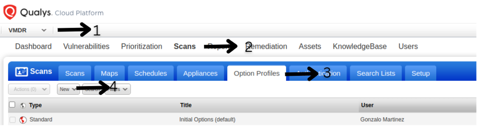
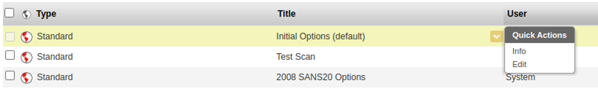
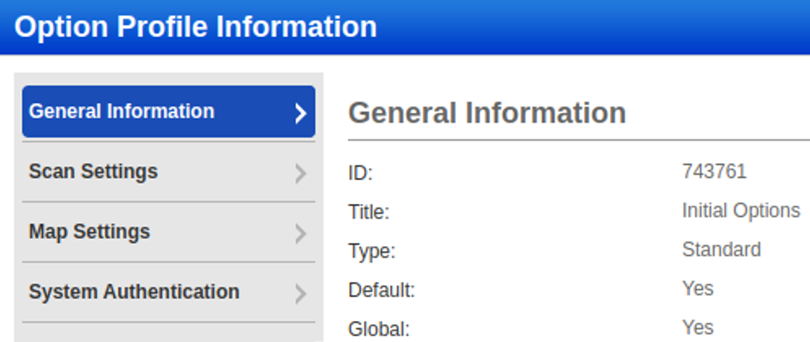

# Faraday’s Qualys Executor

The function of the Qualys Executor is to launch a Qualys scan with certain scan profile to a website.

### Environment Variables

The Qualys executor has 2 environment variables: QUALYS_USERNAME and QUALYS_PASSWORD, which are the same ones used to access the Qualys web site.

### Parameters:
The Qualys executor has 2 mandatory parameters:
- Target Ip  which is the ip of the site you want to scan. The executor will create the target ip in Qualys in case it is not already created.
- Option Profile which is the ip of the profile scan you want to use. The Option Profile must already be created to perform the scan. In case of using an incorrect number, the executor will display an error message and show the current profiles available in the dispatcher logs.

You can also use a Pull interval, this parameter will setup how often the Agent will check if the scan is already finished. If no value is used the default pull interval will be 180 seconds.

## Create a scan profile in Qualys:

To add a scan profile in the VMDR section go to
Scans->Option Profiles->new->Option Profile

then a window will open, complete the information as you see fit.

** To check the id of a Profile click in the title column click info in the drop menu.  

The id is the first parameter in the next image:

