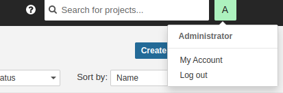
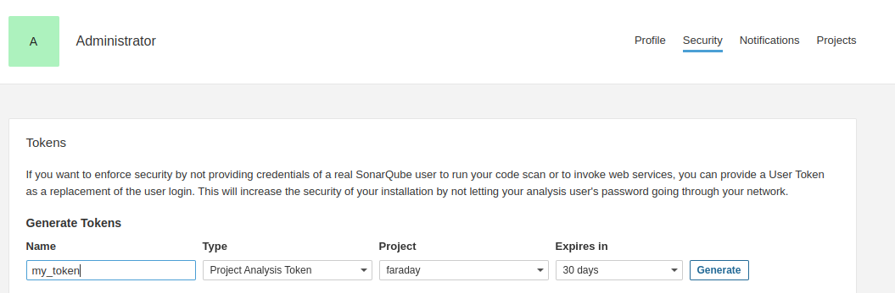

# Faraday’s SonarQube Executor

The SonarQube executor function is to download and import the vulnerabilities detected by SonarQube.

### Environment Variables

The SonarQube executor has 1 environment variable: SONAR_URL, which is the url of where your sonarcube server is hosted.
(example: http://localhost:9000)

### Parameters:
The SonarQube executor has 1 mandatory parameters:
- Token:  which is the token generate by SonarQube

You can use the Component key parameter to limit the export to vulnerabilities of that component.

## Generate a token

To generate a new token click in your profile picture then go to My Account

Then go to Security tab, write the name of the new token and select the type of token you want. If you select Project Analisys Token
verify that the project select is correct.

Then click in generate and the token will be displayed.
