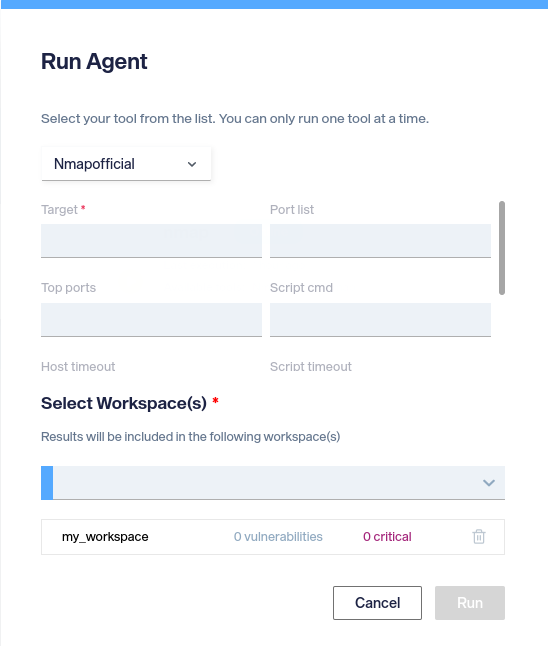

# Agents & Executors

**Dispatcher version:** 3.9.1 | **Faraday Server:** 5.x

The Faraday Agent Dispatcher automates security tool execution by running **executors** — scripts that wrap specific tools and output results in Faraday-compatible JSON. This page covers the executor model, environment variable system, parameter types, and how to develop custom executors.

---

## Executors



An executor is a standalone script that:

1. Reads configuration from **environment variables**
2. Runs a security tool or data collection process
3. Outputs Faraday-compatible JSON to **stdout** (one JSON document per line)
4. Outputs logging/diagnostic info to **stderr**
5. Exits with code 0 on success, non-zero on failure

Executors can be written in **any language** and interact with any external service. The dispatcher manages their lifecycle as subprocesses.

!!! warning "End of file"
    Both **stdout** and **stderr** streams are assumed closed when the executor process exits.

---

## Environment Variable System

When the dispatcher spawns an executor subprocess, it injects configuration through environment variables from three sources:

### Variable prefixes

| Source | Prefix | Set By | Example |
|--------|--------|--------|---------|
| Runtime arguments | `EXECUTOR_CONFIG_` | Faraday server (from UI/API/scheduler) | `EXECUTOR_CONFIG_TARGET=192.168.1.0/24` |
| Plugin arguments | `AGENT_CONFIG_` | Faraday server (shared filters/tags) | `AGENT_CONFIG_IGNORE_INFO=True` |
| Persistent credentials | *(no prefix)* | Config file `varenvs` section | `NESSUS_USERNAME=admin` |

The executor reads these from its environment — for example, `os.environ["EXECUTOR_CONFIG_TARGET"]` in Python or `$EXECUTOR_CONFIG_TARGET` in Bash.

**List parameters** passed as `EXECUTOR_CONFIG_*` are JSON-encoded:
```
EXECUTOR_CONFIG_TARGETS=["10.0.0.1","10.0.0.2"]
```

**List parameters** passed as `AGENT_CONFIG_*` are comma-separated:
```
AGENT_CONFIG_VULN_TAG=web,critical
```

### Common agent parameters (plugin arguments)

These parameters are sent by the Faraday server and are available to all executors:

| Variable | Type | Description |
|----------|------|-------------|
| `AGENT_CONFIG_IGNORE_INFO` | Boolean | Skip informational-severity vulnerabilities |
| `AGENT_CONFIG_RESOLVE_HOSTNAME` | Boolean | Resolve hostnames to IP addresses |
| `AGENT_CONFIG_MIN_SEVERITY` | String | Minimum severity filter |
| `AGENT_CONFIG_MAX_SEVERITY` | String | Maximum severity filter |
| `AGENT_CONFIG_VULN_TAG` | CSV list | Tags to apply to vulnerabilities |
| `AGENT_CONFIG_SERVICE_TAG` | CSV list | Tags to apply to services |
| `AGENT_CONFIG_HOSTNAME_TAG` | CSV list | Tags to apply to hosts |

!!! info "Debugging executors"
    The environment variable system makes executor debugging straightforward — you can run an executor directly without the dispatcher by setting the expected variables:
    ```sh
    export EXECUTOR_CONFIG_TARGET="192.168.1.1"
    ./my_executor.py
    ```

---

## Parameter Type System

The `faraday_agent_parameters_types` package (v1.9.1) provides **10 validated types** for executor parameters. The dispatcher validates parameters against their declared types **before** spawning the executor — invalid parameters result in a `RUN_STATUS` error sent back to the server.

| Type | Validation | Example Use |
|------|-----------|-------------|
| `string` | Any non-empty string | `target_host` |
| `integer` | Whole number | `port` |
| `float` | Decimal number | `timeout` |
| `boolean` | `true` / `false` | `verbose` |
| `list` | JSON array of strings | `targets` |
| `ip` | Valid IPv4/IPv6 address | `scan_target` |
| `url` | Valid URL format | `api_endpoint` |
| `password` | Masked string (hidden in UI) | `secret_key` |
| `domains` | Comma-separated domain names | `target_domains` |
| `range` | IP range (CIDR or dash notation) | `network_range` |

---

## Official Executors

The dispatcher ships with **27 pre-configured executors** in `faraday_agent_dispatcher/static/executors/official/`. Each has a manifest JSON file (in `faraday_agent_parameters_types`) that defines its configuration:

```json
{
  "cmd": "python {EXECUTOR_FILE_PATH}",
  "repo_executor": "nmap.py",
  "environment_variables": ["NMAP_EXTRA_ARGS"],
  "arguments": {
    "target": {
      "mandatory": true,
      "type": "ip",
      "base": "string"
    }
  },
  "check_cmds": ["nmap --version"],
  "category": ["Network & Vulnerability Scanners"]
}
```

| Manifest field | Purpose |
|----------------|---------|
| `cmd` | Command template. `{EXECUTOR_FILE_PATH}` is replaced with the absolute path to the executor script |
| `repo_executor` | Filename of the executor script in `static/executors/official/` |
| `environment_variables` | List of credential env vars that must be set in `varenvs` |
| `arguments` | Parameter definitions with type, mandatory flag, and base type |
| `check_cmds` | Shell commands to verify tool dependencies before execution |
| `category` | Tool category for UI grouping |

When using the [configuration wizard](../getting-started.md), official executors are auto-detected — the wizard knows their environment variables and parameters, and will prompt for values.

---

## Custom Executors

You can create executors in any language. The dispatcher doesn't care about implementation details — only about the input/output contract.

### Minimal Python example

```python
#!/usr/bin/env python3
import os
import json
import sys

target = os.environ.get("EXECUTOR_CONFIG_TARGET", "")

if not target:
    print("No target specified", file=sys.stderr)
    sys.exit(1)

# Your tool logic here
results = {
    "hosts": [
        {
            "ip": target,
            "description": "Scanned host",
            "hostnames": [],
            "services": [],
            "vulnerabilities": []
        }
    ]
}

print(json.dumps(results))
```

### Minimal Bash example

```bash
#!/bin/bash
TARGET="${EXECUTOR_CONFIG_TARGET}"

if [ -z "$TARGET" ]; then
    echo "No target specified" >&2
    exit 1
fi

# Run your tool and convert output to Faraday JSON
echo "{\"hosts\": [{\"ip\": \"${TARGET}\", \"services\": [], \"vulnerabilities\": []}]}"
```

### Registering a custom executor

Add the executor to your `dispatcher.yaml` config file:

```yaml
agent:
  executors:
    my_tool:
      cmd: /path/to/my_executor.py
      max_size: 65536
      varenvs:
        API_KEY: "your-api-key"
      params:
        target:
          mandatory: true
          type: string
          base: string
        verbose:
          mandatory: false
          type: boolean
          base: string
```

Or use the interactive wizard:

```shell
faraday-dispatcher config-wizard
```

The wizard will prompt for custom executor details: command path, environment variables and their values, parameters and whether they are mandatory.

---

## Result Submission (bulk_create)

### Stdout format

The executor's stdout must produce JSON matching the Faraday `bulk_create` schema. Each line should be a complete JSON document:

```json
{
  "hosts": [
    {
      "ip": "192.168.1.1",
      "description": "Target host",
      "hostnames": ["server.example.com"],
      "os": "Linux",
      "services": [
        {
          "name": "http",
          "port": 80,
          "protocol": "tcp",
          "status": "open",
          "version": "Apache 2.4",
          "vulnerabilities": [
            {
              "name": "Apache Version Disclosure",
              "desc": "The server exposes its version number",
              "severity": "low",
              "refs": ["CVE-2024-XXXX"],
              "tags": ["web", "disclosure"],
              "data": "Additional technical details...",
              "type": "Vulnerability"
            }
          ]
        }
      ],
      "vulnerabilities": []
    }
  ]
}
```

### Processing pipeline

The `StdOutLineProcessor` handles each line of stdout:

1. Parses the line as JSON
2. Appends `execution_id` and `command` metadata
3. POSTs to `/_api/v3/ws/{workspace}/bulk_create` for each target workspace
4. Authentication: `Authorization: agent <agent_token>`
5. Expected response: HTTP 201

When the executor process exits, the dispatcher sends a final `bulk_create` with an empty hosts array and the execution duration (in microseconds):

```json
{
  "hosts": [],
  "execution_id": 42,
  "command": {
    "tool": "my-agent",
    "command": "nmap_scan",
    "user": "",
    "hostname": "",
    "params": "target=192.168.1.0/24",
    "import_source": "agent",
    "start_date": "2026-02-27T10:30:00",
    "duration": 45000000
  }
}
```

### Stderr

Stderr output is captured by the `StdErrLineProcessor` and logged to the dispatcher console. It does not affect data submission — use stderr for progress messages, debug info, and error reporting.

---

## Dispatcher Internals

### Communication with executors

The dispatcher communicates with executors through:

- **Input:** Environment variables (set before subprocess creation)
- **Output:** stdout for data (JSON), stderr for logs
- **Lifecycle:** `asyncio.create_subprocess_shell` with concurrent stdout/stderr readers

### Why async?

The dispatcher is single-process, single-threaded, and async for good reasons:

1. It runs multiple executors concurrently — each executor gets its own stdout/stderr reader coroutines
2. It is IO-bound, spending most time waiting for news from the server or executors
3. Executors can be in any language, so they run as subprocesses (not in-process)

All of this maps naturally to Python [asyncio][asyncio]:

- A waiting coroutine for Socket.IO commands
- A launch-executor coroutine per run command
- Stdout and stderr reader coroutines per executor

!!! warning
    While there are only 3 types of coroutines, multiple instances run simultaneously. The main coroutine is always running, plus 3 coroutines per active executor.

[asyncio]: https://docs.python.org/3/library/asyncio.html
