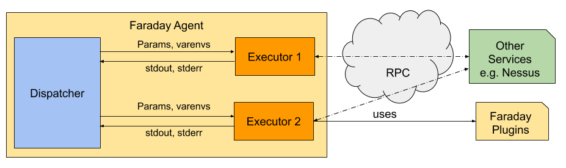

# Agents

Using [Faraday][faraday] to upload reports from tools is great. But when
 automatizing a scan, it is not expected to write scripts mixing its Python API
 configuration with the scan code. Moreover, if the scan code is in other
 language and/or another host, there will be code mangling the http connection.

On runtime, the Faraday Agent will be in charge of the connection, and be focus
 on the code automatizing the scan.

## Executors



The important code which the Agent can run resides in the Executors, it can
 be in any language, and interact with any other resources. The only expected
 behaviour is as it were part of a shell pipeline, meaning that its output
 is expected to by:

 * stdout: Only relevant data sent to Faraday, it must be in json format,
 expected to be received by the [Faraday API][API]
 * stderr: All kind of info not relevant to Faraday, such as information
  and errors.

!!! warning "End of file"
    Both **stdout** and **stderr** are assumed closed by receiving double `\n`.

Some executors are parametrized by:

 * Environment variables: These contains fixed or private configuration,
 such as API Tokens, directory or file path, etc.
 * Arguments: These parameters comes from Faraday, and can differ between
  executions, such as IP range, a feature flag, etc. All parameters
  goes by environment variables, prefixed as `EXECUTOR_CONFIG_{PARAM_NAME}`
  to not conflict with actual environment variables. It is configurable if they
  are mandatory or not.

Also faraday server can send plugins arguments when you run an executer.
These are:
- AGENT_CONFIG_IGNORE_INFO: Bool, will ignore info level vulnerabilities.
- AGENT_CONFIG_RESOLVE_HOSTNAME: Bool, will resolve the hostname if posible.
- AGENT_CONFIG_VULN_TAG: List of strings, will add the tags to the vulns.
- AGENT_CONFIG_SERVICE_TAG: List of strings, will add the tags to the services.
- AGENT_CONFIG_HOSTNAME_TAG: List of strings, will add the tags to the hosts.

!!! info
    All that configuration allows executor debugging being a lot more easier,
    not needing the Agent to be run, only with a shell command
    ```sh
    $ ./my_executor # This assume, as within the agent, that the enviroment is ready
    ```

### Official executors
The Faraday agent is shipped with some pre-configured executors. While
 configuring the agent with the [configuration wizard][wizard], it will already
 know with are the environment variables and arguments. It will ask for the
 variables values and will be ready to go. These executors are in
 `faraday_agent_dispatcher/static/executors/official`, and all their
 configuration is in its own manifest JSON file.

### Custom executors
When requiring a custom executor, its possible to configuring them with the
 [configuration wizard][wizard], and it will ask for which are the environment
 variables and their value as for the parameters, and whether they are
 mandatory or not.

## Dispatcher


The agent dispatcher is a middleware, between the executors, and the Faraday
 server. It will handle the multiple processes and communication with them,
 and with the server.

### Communication with Faraday

When communicating with Faraday there are some things to be aware of:

 * The agent initiates the communication, no matter if it is registering
  itself as a new agent or just connecting in an restart process.
 * The server has a collection of Agents to run executors, and has the
  ability to say when to run them. A never ending executor, **always**
  receive the first start command from the server.
 * For now, the agent only post data to the server, when any executor says
  it has new data.

That being said, it is clearly separated between two different type of
 connection between Agent and server:

 * REST API: General data, such as registering a new agent and publishing
  new data. Its always the agent interacting with the server.
 * Websockets: Commands data, its a separated protocol for agents management.

#### REST API
Faraday has a vast REST API, and there are a few endpoints used by
 the agent, which are used for:

 * `/_api/v3/info`: Connectivity check.
 * `/_api/v3/agents`: [POST] Registration of a new agent.
 * `/_api/v3/agent_websocket_token`: Get a [websocket](#websockets) token.
 * `/_api/v3/ws/{workspace_name}/bulk_create`: Publish data to a specific
  workspace

!!! info "REST API Documentarion"
    For more info about the API, use its own [documentation][API]

#### Websockets
For commands, a bidirectional communication is expected between the Agent
 and the server.
The server can only send a `RUN` command, specifying which
 executor to run, its parameters, plugins arguments (ignore info, resolve_hostname) and to which workspaces post the data. It
 also has some metadata relevant to the faraday server to identify the
 execution.

The agent is able to notify the server with three actions:

 * `JOIN_AGENT`: Notify the server it is ready to run, which executors are
  available and their params.
 * `LEAVE_AGENT`: Notify of disconnection.
 * `RUN_STATUS`: After a `RUN` command, notify if something was wrong and
  won't run, or if the executor run successfully or not.

### Communication with executors
[As mentioned before](#executors), executors take parameters and environment
 variables as input methods, and standard files as stderr and stdout as
 output methods.

### Why is the agent asynchronous?
There are some reasons for that:

 1. It is expected the dispatcher runs multiples executors at the same time,
 and isn't waiting to be finished while midway data is ready to be sent.
 1. Moreover, the dispatcher is just a IO-bound middleware, waiting for
 news from the server or the executors.
 1. Finally, the executors can be written in any language, that
 means they can be in the same process.

All these features can be accomplished by using Python [asyncio][asyncio]
 in the development of it. So, the dispatcher is a single-process with
 single-threading. Its living coroutines basically are:

 * A waiting coroutine for web-sockets commands.
 * A launch executor coroutine.
 * The listen a stderr and stdout from executor coroutines.

!!! warning
    As its mentioned there are only 3 types of living coroutines, but are
    multiple running. The main coroutine is always running or waiting, and 3
    more coroutines are running for each executor.

[API]: https://api.faradaysec.com
[faraday]: https://github.com/infobyte/faraday
[wizard]: ../418.md
[asyncio]: https://docs.python.org/3/library/asyncio.html
