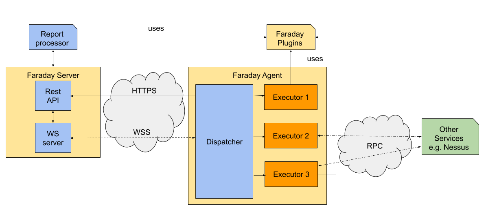

#Architecture
Faraday is a web application, the [server][server] is made with Python using
 Flask. Its possible to automatize tool usage with Faraday [agents][agents].

## Faraday server
Faraday is accessed by a Web Browser or the [Faraday Client][client].
Both clients, communicate with Faraday Server via its [REST API][api].

The server has other main components as the Report Processor, or the Websocket
 Server. The latter provides information to the Client.

## Faraday agent
The agent is an application composed by scripts discovering information,
 called **executors**. They can access any external services or use the
 Faraday's Report Processor.

The data found by them is sent to the Faraday server by a middleware called
 **Dispatcher**, which will be the only module communicating with the server.
 Moreover, the Dispatcher is in charge of the scheduling of executors, backed
 by its implementation with [asyncio][asyncio].

The Dispatcher uses the [Faraday API][api] to first communication and
 publishing the data, specially the [bulk_create endpoint][bulk_create]. In
 addition, the only communication via the websocket server are the commands
 from faraday, such as which executor will run and its arguments values,
 execution status updates, etc. The executors communicates by the standard
 output the data to publish, and by the standard error any information about
 the run.

[server]: https://github.com/infobyte/faraday
[agents]: https://github.com/infobyte/faraday_agent_dispatcher
[client]: https://github.com/infobyte/faraday-client
[api]: https://api.faradaysec.com
<!-- TODO See when launched -->
[bulk_create]: https://api.faradaysec.com#BulkPost
[asyncio]: https://docs.python.org/3/library/asyncio.html
